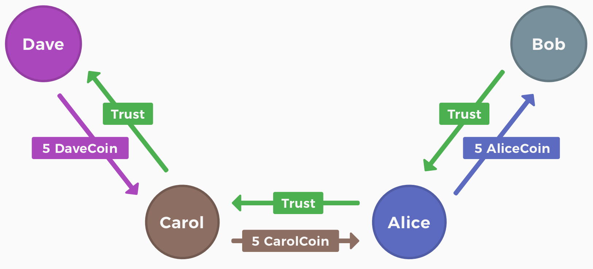

## Community Circles

Notice: during the hackathon we worked out advanced specifications for the whole problem. Unfortunately we did not complete enough implementation parts to stitch together a minimal feasible working demo the hackathon.

As Circles UBI is a public goods project, we thought we'd still write up the context and a highlevel of some of the specification in this readme and submit it to have a record at zkIstanbul.

## Context

Circles UBI ([joincircles.net](https://joincircles.net/)) is a cooperative project that has been supporting a novel idea for an unconditional income for all people for many years.

Circles uniquely addresses the sybil-resistance problem not with a global registry of unique humans, but with a local, ground-up symmetry property of the UBI token:

> Everyone can mint one token per hour - their own ERC20 token. To make these tokens fungible, other people need to trust your account explicitly to be unique to you.

By introducing a trust graph of unique people, they also commit to having their tokens to be 1-1 fungible with the tokens of the people they trust to be authentic.

That way we construct a path-fungibility where the tokens can be transferred to unknown people, if a trust path connecting sender and receiver can be found.

An illustrative example of a transfer occurring over a trust path can be found in the Circles UBI whitepaper and is reproduced below:




(from https://github.com/CirclesUBI/whitepaper)

## Problem

The existing implementation exposes the trust graph **publicly** in solidity on-chain. To advance the project, we need to come up with a proposal to shield this valuable asset of a social graph while still enabling path transfers.

## Our work at zkIstanbul

We introduce the idea of "*communities*" as a shielding contract on L1 (or L2 for scalability).

We used Aztec Noir to build the (recursive) proofs, but burned a lot of time on trying to convert provided higher-level types back to Field elements for the recursive proof public inputs (note to Aztec: the documentation and examples are sparse on this advanced topic, nor could we find example in the v3 code-base as reference).

### Flow matrix

By expressing the path transfer in a flow matrix where each row is a transfer of a specific token between to people (where the receiver trusts this token); and each column is a participant along the path-transfer, we can prove conservation of in-and-out flow for intermediate participants, and assert correct sender and receiver amounts at the start and end of the path.

This flow matrix can be extended from a single-path-transfer to a batch-path-transfer.

### Circle nodes

As each human has their own token, which other people can have a balance of, in addition for each token we need to track who accepts it as fungible for their own tokens (reflecting the trust graph between people).

To implement this, the community shielding contract tracks the root of a community Merkle tree; and each leaf of the community tree is a Circle node (Merkle tree) with the following state as leaves:
 - identifier of person within community
 - balance of this token held by the person
 - boolean of whether this person trusts this token,
   and hence accepts it to be fungible for theirs

By storing "Bob" in Alice's Circle Node, when "Bob trusts Alice", we can prove all relevant segments of a path transfer where "Alice's tokens" are transferred, while we have unpacked the leaves of Alice's node.

So we can iterate over each Circle Node that is part of a larger path-transfer, and compute a proof of all the transfer edges, asserting the trust relations were obeyed, and the balances preserved.

These Circle Node proofs we can level up to a top level proof by recursively summing up all rows of the flow matrix (described above) and in the top level proof assert that:
- sender signed to initiate the path-transfer
- all intermediate people have their balance conserved; ie. the same amount of tokens flowed in, as flowed out, even if the "colours" of them changed.
- the total path connects correctly without double spending edges

# Privacy among communities

By having private identifiers within each community one joins, we can ensure that people's identity is not leaked among communities. For example, if Alice and Bob know each other in one community they both joined, and trust each other there, we don't want that to leak to Bob or Alice in a different community: if they both joined a different community but don't know eachother there, they cannot identify eachother without in person trusting and exchanging the new identifiers.

# transfers among communities

if alice is a member of two communities, we can recursively proof two segments of a path transfer from one community to the other through overlapping members.

# exiting back to L1 with "white community tokens"

if the community does valuable work, it is important to be able to exit the community with your tokens. We can do this with "community tokens" on L1, that don't leak the information of the personal trust tokens.

# preventing confliciting duplicate mints across communities

Using Rate Limiting Nullifiers to assert the relative amounts of how much of one's new UBI minting tokens, we can ensure that anyone why tries to have conflicting (and more than 1 token per human per hour) mints across different communities can be slashed for that period.


work by Michael and Ben

CC-0 licensed
------

**Foundry is a blazing fast, portable and modular toolkit for Ethereum application development written in Rust.**

Foundry consists of:

-   **Forge**: Ethereum testing framework (like Truffle, Hardhat and DappTools).
-   **Cast**: Swiss army knife for interacting with EVM smart contracts, sending transactions and getting chain data.
-   **Anvil**: Local Ethereum node, akin to Ganache, Hardhat Network.
-   **Chisel**: Fast, utilitarian, and verbose solidity REPL.

## Documentation

https://book.getfoundry.sh/

## Usage

### Build

```shell
$ forge build
```

### Test

```shell
$ forge test
```

### Format

```shell
$ forge fmt
```

### Gas Snapshots

```shell
$ forge snapshot
```

### Anvil

```shell
$ anvil
```

### Deploy

```shell
$ forge script script/Counter.s.sol:CounterScript --rpc-url <your_rpc_url> --private-key <your_private_key>
```

### Cast

```shell
$ cast <subcommand>
```

### Help

```shell
$ forge --help
$ anvil --help
$ cast --help
```
